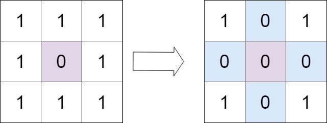

# 73. 矩阵置零

[来源](https://leetcode-cn.com/problems/set-matrix-zeroes/)

## 题目

给定一个 `m x n` 的矩阵，如果一个元素为 **0** ，则将其所在行和列的所有元素都设为 **0** 。请使用 **[原地](http://baike.baidu.com/item/原地算法)** 算法**。**

**进阶：**

- 一个直观的解决方案是使用  `O(mn)` 的额外空间，但这并不是一个好的解决方案。
- 一个简单的改进方案是使用 `O(m + n)` 的额外空间，但这仍然不是最好的解决方案。
- 你能想出一个仅使用常量空间的解决方案吗？

 

**示例 1：**



```
输入：matrix = [[1,1,1],[1,0,1],[1,1,1]]
输出：[[1,0,1],[0,0,0],[1,0,1]]
```

**示例 2：**


```
输入：matrix = [[0,1,2,0],[3,4,5,2],[1,3,1,5]]
输出：[[0,0,0,0],[0,4,5,0],[0,3,1,0]]
```

 

**提示：**

- `m == matrix.length`
- `n == matrix[0].length`
- `1 <= m, n <= 200`
- $-2^{31} <= matrix[i][j] <= 2^{31} - 1$​

## 解题

```python
class Solution:
    def setZeroes(self, matrix: List[List[int]]) -> None:
        """
        Do not return anything, modify matrix in-place instead.
        """
        rows, columns = set(), set()
        for i in range(len(matrix)):
            for j in range(len(matrix[0])):
                if matrix[i][j] == 0:
                    rows.add(i)
                    columns.add(j)
        for row in rows:
            for j in range(len(matrix[0])):
                matrix[row][j] = 0
        for column in columns:
            for i in range(len(matrix)):
                matrix[i][column] = 0
```

| 提交结果                                                     | 执行用时 | 内存消耗 | 语言    | 提交时间         | 备注     |
| :----------------------------------------------------------- | :------- | :------- | :------ | :--------------- | :------- |
| [通过](https://leetcode-cn.com/submissions/detail/205117978/) | 36 ms    | 15.3 MB  | Python3 | 2021/08/09 22:53 | 添加备注 |